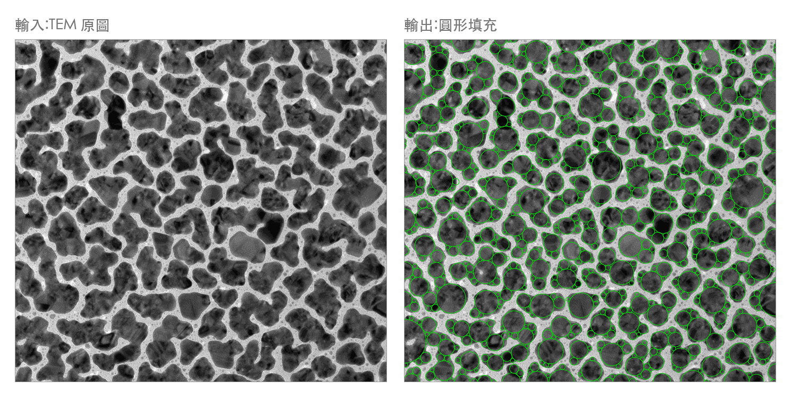

# TurnIntoCircle

TEM(穿透式電子顯微鏡)影像的 Au 奈米顆粒偵測工具:自動偵測影像中的金顆粒、
描出輪廓,並把每個顆粒島轉成圓形清單(`circles.csv`),
可直接當作 FDTD 光學模擬的幾何輸入。

## 範例

以 `data/` 裡的參考影像(2048×2048、左下角 50 nm 比例尺):

<!-- 左右兩張已經在 docs/make_example.py 裡合成為單一張圖片。
     用表格並排兩個圖檔的話,渲染器會自己分配欄寬,兩邊很難剛好一樣大。 -->


## 線上使用

不用安裝任何東西,直接開瀏覽器使用:

**https://turnintocircle-avbjpdhgmiygpwiaxottrj.streamlit.app**

上傳 TEM 影像 → 按「開始偵測」→ 下載 `circles.csv`。
閒置一段時間後 app 會休眠,第一次開啟可能要等約 30 秒喚醒。

想在自己電腦上跑(影像不外傳)請看下面的安裝說明。

## 功能

- 從燒錄在影像左下角的 Gatan 比例尺**自動量測 nm/px 校正值**(沒有比例尺的影像可手動指定)
- 自動裁掉底部含比例尺的整條橫排,輸出範圍保持完整矩形
- Otsu 二值化 + 形態學清理 + 輪廓偵測 + 面積過濾
- 貪婪圓形填充:圓有最小直徑限制(FDTD 網格約束,預設 5 nm),可選擇是否允許重疊
- 輸出:標註圖(輪廓、拼圓)、`particles.csv`(顆粒統計)、`circles.csv`(FDTD 幾何,單位 nm)

## 安裝

需要 **Python 3.10 以上**(Streamlit 的要求;開發環境為 3.13)。
macOS 內建的 `/usr/bin/python3` 是 3.9,太舊不能用,請先 `brew install python@3.13`。

```bash
git clone https://github.com/318amne-Sia/turnintocircle.git
cd turnintocircle

# macOS / Linux
python3.13 -m venv .venv
.venv/bin/pip install -r requirements.txt

# Windows
# python -m venv .venv
# .venv\Scripts\pip install -r requirements.txt
```

## 使用方式

### 網頁介面(推薦)

```bash
.venv/bin/streamlit run streamlit_app.py
```

瀏覽器會自動開啟 http://localhost:8501 。拖曳上傳 TEM 影像 → 按「開始偵測」
→ 預覽拼圓結果並下載 `circles.csv`。可調參數:最小圓直徑、是否允許重疊、
最小顆粒面積;沒有比例尺的影像請在「進階設定」填入 nm/px 校正值。

### 命令列

```bash
# 處理整個資料夾的 TIF
.venv/bin/python detect_au.py data

# 單張影像 + 常用選項
.venv/bin/python detect_au.py data/xxx.tif --min-area 200 --min-diameter 5
```

常用選項:

| 選項 | 說明 | 預設 |
|---|---|---|
| `--min-diameter` | 拼圓的最小直徑 (nm),FDTD 網格限制 | 5 |
| `--no-overlap` | 禁止圓重疊(覆蓋率會從約 93% 降到約 82%) | 允許重疊 |
| `--min-area` | 最小顆粒面積 (px²),過濾雜訊 | 100 |
| `--nm-per-px` | 手動校正值,影像沒有比例尺時必填 | 自動量測 |
| `--scalebar W H` | 比例尺區域尺寸 (px),`0 0` 表示影像沒有比例尺 | 420 160 |

## 輸出

每張影像會在 `output/` 產生:

- `<原檔名>_contours.png` — 偵測到的顆粒輪廓標註圖
- `<原檔名>_circles.png` — 圓形填充結果標註圖

以及整批共用的:

- `particles.csv` — 每個顆粒的面積、周長、圓形度、質心
- `circles.csv` — 圓形清單(座標與直徑,單位 nm;原點 = 影像左上角,y 向下),FDTD 幾何輸入

## 輸入影像須知

- 針對明場 TEM 影像設計:顆粒為暗色、背景亮
- 支援 TIF/PNG/JPG 等格式,處理前會自動轉灰階
- 參考輸入:Gatan Digital Micrograph 輸出的 2048×2048 TIF,左下角有 50 nm 比例尺
